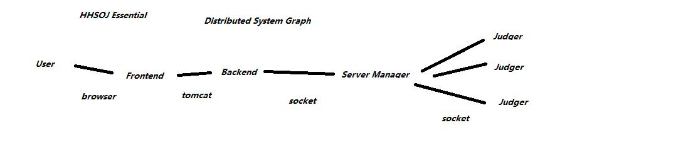

============
OJ Structure
============

The OJ consists of 3 parts.

------
Judger
------

Judgers are servers that run and grade codes. There are many judgers and each of them is independent. They are all connected by socket to the Server Manager.

Judgers receive code and problem information from server manager and judge the code, then they return the result to the server manager. Sometimes they are called Judging Daemons.

--------------
Server Manager
--------------

Server Manager is the core of the whole OJ. It deals with data and requests. Most of the other components connect to it by socket.

------
Tomcat
------

Tomcat is the display core of the whole OJ. It should be run on the same server as server manager in order to fetch data quickly. It hosts the frontend.
